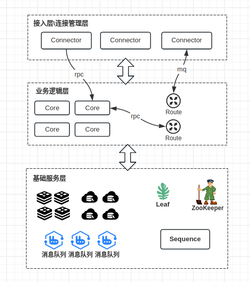

## Fast-im
### 一、技术栈
Java、Netty、RabbitMQ、dubbo、ZooKeeper、Redis、MySQL。
### 二、架构演化
#### 2.1 第一版

初版是在我学习完了Netty、Nginx、ZooKeeper等技术的情况下，为了加深对这些技术的理解，初步设计的分布式IM系统的框架结构，可以看到有很多不完善的地方。

该版本的缺点主要有：
- 每两个MsgServer之间都会互相通过一条TCP连接进行通信，虽然保证了消息的即时性，但是容易产生性能瓶颈。当消息量上去之后，消息在服务节点之间传输时会产生阻塞。
- 框架难以进行扩展，不适合大规模部署。
- 没有对用户在线状态进行集中管理，高度依赖ZooKeeper。

优点：
- 架构简单易懂。
- 实现简单。

#### 2.2 目前的架构图

目前的架构分接入层、业务逻辑层、以及基础服务层。微服务之间的通信主要采用了dubbo和消息队列。

### 三、说明
目前分布式即时通信系统都在core模块下，分层优化还未完成。